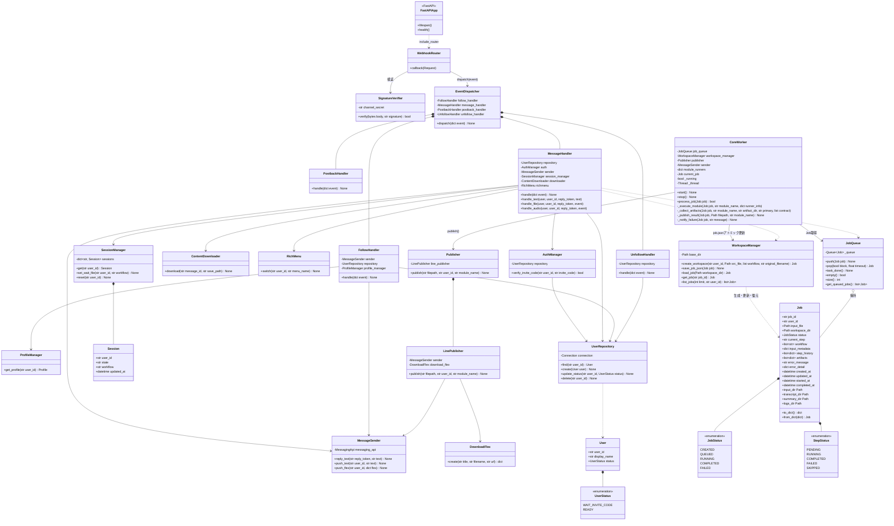

```mermaid
classDiagram
    direction TB

    %% ==========================================
    %% Web / Gateway レイヤー
    %% ==========================================
    class FastAPIApp {
        <<FastAPI>>
        +lifespan()
        +health()
    }
    class WebhookRouter {
        +callback(Request)
    }
    class SignatureVerifier {
        -str channel_secret
        +verify(bytes body, str signature) bool
    }
    class EventDispatcher {
        -FollowHandler follow_handler
        -MessageHandler message_handler
        -PostbackHandler postback_handler
        -UnfollowHandler unfollow_handler
        +dispatch(dict event) None
    }

    FastAPIApp ..> WebhookRouter : include_router
    WebhookRouter --> SignatureVerifier : 検証
    WebhookRouter --> EventDispatcher : dispatch(event)

    %% ==========================================
    %% LINE ハンドラー & プレゼンテーション層
    %% ==========================================
    class FollowHandler {
        -MessageSender sender
        -UserRepository repository
        -ProfileManager profile_manager
        +handle(dict event) None
    }
    class UnfollowHandler {
        -UserRepository repository
        +handle(dict event) None
    }
    class PostbackHandler {
        +handle(dict event) None
    }
    class MessageHandler {
        -UserRepository repository
        -AuthManager auth
        -MessageSender sender
        -SessionManager session_manager
        -ContentDownloader downloader
        -RichMenu richmenu
        +handle(dict event) None
        +handle_text(user, user_id, reply_token, text)
        +handle_file(user, user_id, reply_token, event)
        +handle_audio(user, user_id, reply_token, event)
    }

    EventDispatcher *-- FollowHandler
    EventDispatcher *-- UnfollowHandler
    EventDispatcher *-- PostbackHandler
    EventDispatcher *-- MessageHandler

    class MessageSender {
        -MessagingApi messaging_api
        +reply_text(str reply_token, str text) None
        +push_text(str user_id, str text) None
        +push_flex(str user_id, dict flex) None
    }
    class ContentDownloader {
        +download(str message_id, str save_path) None
    }
    class ProfileManager {
        +get_profile(str user_id) Profile
    }
    class RichMenu {
        +switch(str user_id, str menu_name) None
    }
    class DownloadFlex {
        +create(str title, str filename, str url) dict
    }

    MessageHandler --> MessageSender
    MessageHandler --> ContentDownloader
    MessageHandler --> RichMenu
    FollowHandler --> MessageSender
    FollowHandler --> ProfileManager

    %% ==========================================
    %% ユーザー & 認証層
    %% ==========================================
    class UserStatus {
        <<enumeration>>
        WAIT_INVITE_CODE
        READY
    }
    class User {
        +str user_id
        +str display_name
        +UserStatus status
    }
    class UserRepository {
        -Connection connection
        +find(str user_id) User
        +create(User user) None
        +update_status(str user_id, UserStatus status) None
        +delete(str user_id) None
    }
    class AuthManager {
        -UserRepository repository
        +verify_invite_code(str user_id, str invite_code) bool
    }

    User *-- UserStatus
    UserRepository ..> User
    AuthManager --> UserRepository
    MessageHandler --> AuthManager
    MessageHandler --> UserRepository
    FollowHandler --> UserRepository
    UnfollowHandler --> UserRepository

    %% ==========================================
    %% セッション管理層
    %% ==========================================
    class Session {
        +str user_id
        +str state
        +str workflow
        +datetime updated_at
    }
    class SessionManager {
        -dict~str, Session~ sessions
        +get(str user_id) Session
        +set_wait_file(str user_id, str workflow) None
        +reset(str user_id) None
    }

    SessionManager *-- Session
    MessageHandler --> SessionManager

    %% ==========================================
    %% ジョブ管理 & オーケストレーション層
    %% ==========================================
    class JobStatus {
        <<enumeration>>
        CREATED
        QUEUED
        RUNNING
        COMPLETED
        FAILED
    }
    class StepStatus {
        <<enumeration>>
        PENDING
        RUNNING
        COMPLETED
        FAILED
        SKIPPED
    }
    class Job {
        +str job_id
        +str user_id
        +Path input_file
        +Path workspace_dir
        +JobStatus status
        +str current_step
        +list~str~ workflow
        +dict input_metadata
        +list~dict~ step_history
        +list~dict~ artifacts
        +str error_message
        +dict error_detail
        +datetime created_at
        +datetime updated_at
        +datetime started_at
        +datetime completed_at
        +input_dir Path
        +transcript_dir Path
        +summary_dir Path
        +logs_dir Path
        +to_dict() dict
        +from_dict(dict) Job
    }
    class WorkspaceManager {
        -Path base_dir
        +create_workspace(str user_id, Path src_file, list workflow, str original_filename) Job
        +save_job_json(Job job) None
        +load_job(Path workspace_dir) Job
        +get_job(str job_id) Job
        +list_jobs(int limit, str user_id) list~Job~
    }
    class JobQueue {
        -Queue~Job~ _queue
        +push(Job job) None
        +pop(bool block, float timeout) Job
        +task_done() None
        +empty() bool
        +size() int
        +get_queued_jobs() list~Job~
    }
    class CoreWorker {
        -JobQueue job_queue
        -WorkspaceManager workspace_manager
        -Publisher publisher
        -MessageSender sender
        -dict module_runners
        -Job current_job
        -bool _running
        -Thread _thread
        +start() None
        +stop() None
        +process_job(Job job) bool
        -_execute_module(Job job, str module_name, dict runner_info)
        -_collect_artifacts(Job job, str module_name, str artifact_dir, str primary, list contract)
        -_publish_result(Job job, Path filepath, str module_name) None
        -_notify_failure(Job job, str message) None
    }

    Job *-- JobStatus
    Job *-- StepStatus
    WorkspaceManager ..> Job : 生成・更新・復元
    JobQueue o-- Job : 保持
    CoreWorker --> JobQueue : Job取得
    CoreWorker --> WorkspaceManager : job.jsonアトミック更新
    MessageHandler ..> WorkspaceManager : create_workspace()
    MessageHandler ..> JobQueue : push(job)

    %% ==========================================
    %% 成果物配信層 (Publisher)
    %% ==========================================
    class Publisher {
        -LinePublisher line_publisher
        +publish(str filepath, str user_id, str module_name) None
    }
    class LinePublisher {
        -MessageSender sender
        -DownloadFlex download_flex
        +publish(str filepath, str user_id, str module_name) None
    }

    Publisher *-- LinePublisher
    LinePublisher --> MessageSender
    LinePublisher --> DownloadFlex
    CoreWorker --> Publisher : publish()

```