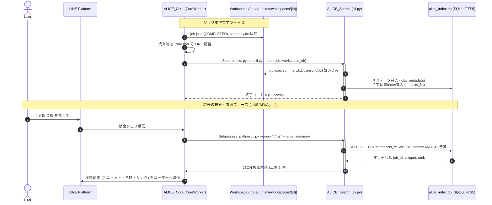

# ALICE v1.0 Knowledge & Search 全体設計書

> Version: v1.0.0 (Design Phase)  
> Status: Proposal  
> Author: Antigravity  
> Date: 2026-09-11  

---

## 1. エグゼクティブサマリー & 現状構成の調査結果

### 1.1 現状構成の調査結果
直前の Job Management 強化により、ALICE_Core のライフサイクル管理は以下の状態に到達しています：
* **1 Job = 1 Workspace**: `/data/runtime/workspaces/{job_id}/` にすべての入力、成果物、ログ、`job.json` が完全に自己完結して保持される。
* **Source of Truth の確立**: `job.json` は実データ本文を格納せず、メタデータ・進捗（`current_step`, `step_history`）・成果物参照（`artifacts`）・構造化エラー（`error_detail`）の完全な正本として機能している。
* **現状の課題**:
  * `WorkspaceManager.list_jobs()` はディレクトリを都度 `iterdir()` して `job.json` を線形探索（$O(N)$）しているため、ジョブ数が数百〜数千件に達した際にファイル I/O がボトルネックとなる。
  * **「過去の会話内容（Transcript）」や「要約（Summary）」の本文をキーワードやトピックで横断検索する手段が現在存在しない**。

### 1.2 設計の最重要結論
1. **最初から Vector DB / RAG を導入しない（明確な技術的判断）**:
   * Whisper と Gemma 12B/4B が稼働する ALICE 環境において、常時 Embedding 生成や Vector DB プロセスを走らせることは GPU/VRAM 競合とシステム複雑化の元凶となります。
   * 会話記録の検索において、ユーザーがまず求めるのは「人名」「日付」「プロジェクト名」「決定事項キーワード」の完全・高速な特定であり、これは **SQLite FTS5（全文検索）** で 90% 以上満たせます。
2. **「Workspace = Source of Truth」の絶対厳守**:
   * 検索用データベースは **「失われても Workspace 群から 100% 再構築（Rebuild）できる派生キャッシュ（Read-Optimized Index）」** として位置づけます。
3. **独立モジュール `ALICE_Search` の新設**:
   * Core に検索処理を抱え込ませず、既存の **Workspace Driven CLI 原則** に従って独立したモジュールとして設計します。

---

## 2. Knowledge / Search の責務分担

```mermaid
graph TD
    subgraph ALICE_Core ["ALICE_Core (オーケストレーター)"]
        WM[WorkspaceManager]
        CW[CoreWorker]
    end

    subgraph ALICE_Search ["ALICE_Search (検索・インデックスモジュール)"]
        CLI[Search CLI]
        Indexer[Search Indexer]
        Engine[Search Engine]
        DB[(alice_index.db\nSQLite + FTS5)]
    end

    subgraph ALICE_Knowledge ["将来: ALICE_Knowledge (統合知識化 / RAG)"]
        RAG[RAG Synthesizer]
        Graph[Knowledge Graph]
    end

    subgraph Storage ["Physical Workspaces (Source of Truth)"]
        WS1["/workspaces/job_001/\njob.json\ntranscript.txt\nsummary.md"]
        WS2["/workspaces/job_002/\njob.json\ntranscript.txt\nsummary.md"]
    end

    CW -->|1. Job完了時にCLI呼出\n--index-job <ws>| CLI
    CLI --> Indexer
    Indexer -->|2. Artifact読込| Storage
    Indexer -->|3. 派生メタデータ・転置Index更新| DB
    Engine -->|4. 高速検索 (B-Tree + FTS5)| DB
    CLI --> Engine
    
    RAG -.->|将来: 検索結果を参照して知識合成| CLI
    Indexer -.->|いつでも全Workspaceから再構築可能| Storage
```

* **ALICE_Core**:
  * 責務: ジョブの受付・実行・完了通知。検索ロジックそのものは一切持たず、ジョブ完了時に `ALICE_Search` を呼び出すか、検索要求を `ALICE_Search` に委譲するクライアントに徹する。
* **ALICE_Search** (本設計の主対象):
  * 責務: Workspace 群からの検索用インデックス（`alice_index.db`）の作成・更新・保守、および高速な属性検索・全文検索の提供。
* **ALICE_Knowledge** (将来構想):
  * 責務: 複数の Job / 成果物から得られた検索結果をもとに、文脈統合・矛盾解消・長期記憶化・RAG 回答合成を行う上位認知レイヤー。

---

## 3. Search の段階設計 (4-Layer Model)

検索機能を以下の 4 段階にレイヤー化し、各段階の技術特性と導入時期を定義します。

| レイヤー | 検索方式 | 何ができるのか | 検索対象 | 導入時期 | v1.0要否 |
| :--- | :--- | :--- | :--- | :--- | :--- |
| **Layer 1** | **Job / Metadata Search** | ジョブ属性（ユーザー、ステータス、日付、ファイル名、ワークフロー）による完全一致・範囲検索・ソート | `job.json`, `input_metadata` | 即時 | **必須 (v1.0)** |
| **Layer 2** | **Full Text Search (FTS)** | 「予算」「佐藤」「解約」など、発言・要約内の単語による完全一致・プレフィックス・部分一致検索。スニペット抽出 | `summary.md`/`txt`, `minutes.md`/`txt`, `transcript.txt` | v1.0 | **必須 (v1.0)** |
| **Layer 3** | **Semantic Search** | 「顧客離れへの対応」など、単語が完全一致しなくても意味的類似度（Embedding）で探す | Summary セクション, Minutes アジェンダ, 発話トピックチャンク | v1.x / v2.0 | **将来保留** |
| **Layer 4** | **Knowledge / RAG** | 「過去3回の会議を踏まえて課題をまとめて」といった複数会議の横断推論・自動回答 | 全成果物チャンク + LLM Context Augmentation | v2.0+ | **将来保留** |

### 「最初から Vector DB / RAG を導入しない」技術的評価
1. **GPU/VRAM 競合の回避**:
   * ALICE はすでに `ALICE_Transcript`（Whisper: 3〜6GB VRAM）と `ALICE_Summary`（Gemma 12B: 8〜10GB VRAM）でリソースを消費します。ジョブ完了ごとに Embedding モデル（1〜2GB VRAM）を割り込ませると、OOM（メモリ枯渇）やスワップ遅延のリスクが跳ね上がります。
2. **業務会話検索における FTS の優位性**:
   * 議事録・会話ログの検索において、最も頻出するのは「プロジェクト名」「取引先企業名」「数値」「日付」「固有の決定事項」です。これらは **Vector 検索が最も苦手とし、FTS が最も得意とする領域** です。
3. **インフラの単純性**:
   * Vector DB（Qdrant, Chroma 等）をデーモン起動するとプロセスの監視や死活管理が必要になりますが、SQLite FTS5 は単一の C ライブラリ（Python 組み込み）で動作し、追加障害点がゼロです。

---

## 4. 検索対象と Artifact の扱い（分離原則）

「成果物」「Job metadata」「ログ」を同一の検索対象に混ぜると検索ノイズが発生するため、以下のように役割を厳格に分離します。

```text
┌─────────────────────────────────────────────────────────────┐
│                      検索対象の3層分離                       │
├─────────────────┬───────────────────┬───────────────────────┤
│ ① Job Metadata  │ ② Content Artifacts│ ③ Execution Logs     │
│ (job.json)      │ (summary, trans)  │ (logs/*.log)          │
├─────────────────┼───────────────────┼───────────────────────┤
│ ・job_id        │ ・summary.md/txt  │ ・transcript.log      │
│ ・user_id       │ ・minutes.md/txt  │ ・summary.log         │
│ ・created_at    │ ・transcript.txt  │                       │
│ ・status        │ ・transcript.json │                       │
│ ・file_name     │                   │                       │
├─────────────────┼───────────────────┼───────────────────────┤
│ 【用途】         │ 【用途】          │ 【用途】              │
│ フィルタ・絞込   │ 全文検索・本文参照 │ 障害調査・監査        │
│ (B-Tree Index)  │ (FTS5 転置Index)  │ (検索Index対象外！)   │
└─────────────────┴───────────────────┴───────────────────────┘
```

### 成果物内の優先順位（Hierarchical Retrieval）
全文検索時、全ファイルをフラットに検索するのではなく、情報の**密度（Information Density）**に応じた重み付けを行います：
1. **第 1 優先: `summary.md` / `minutes.md` (高密度要約・決定事項)**
   * ノイズが最も少なく、会議の結論や要点が凝縮されているため、最優先でヒットさせる。
2. **第 2 優先: `transcript.txt` / `transcript.json` (一次発話データ)**
   * 「誰が何と言ったか」「要約で省かれた細部の文脈」を確認するためのバックアップとして検索する。
3. **除外: `logs/*.log`**
   * システムログ（HTTPリクエスト、プロセスログ、デバッグ文字列）は、会話検索の結果を汚染するため**インデックス対象から完全に除外**する。

---

## 5. Index / Storage 設計

### 5.1 ストレージ比較と選定

| 方式 | 特徴 | 利点 | 欠点 | 評価 |
| :--- | :--- | :--- | :--- | :--- |
| **A. Workspace 直接走査** | 毎回 `job.json` やファイルを grep | インデックス不要、DB不要 | ジョブ数増加で極端に遅い ($O(N)$ I/O) | × 不採用 |
| **B. 単一 JSON インデックス** | 1つの巨大 JSON にメタデータを集約 | 実装が単純 | 同時書き込み競合、全文検索不可 | × 不採用 |
| **C. SQLite + FTS5** | 単一 DB ファイルにメタデータと全文インデックスを保持 | **標準ライブラリ、外部サーバ不要、爆速、B-Tree+FTS5同時利用可能** | 外部形態素解析器の選定に注意 | **◎ 本命採用** |
| **D. 独立 Vector DB** | Chroma / Qdrant 等 | 意味的類似度検索が可能 | 重い、GPU消費、運用の複雑化 | △ 将来検討 |

### 5.2 SQLite + FTS5 によるスキーマ設計
保存場所: `/data/runtime/search/alice_index.db`

```sql
-- 1. Job メタデータテーブル (B-Tree Index)
CREATE TABLE IF NOT EXISTS jobs_metadata (
    job_id TEXT PRIMARY KEY,
    user_id TEXT NOT NULL,
    status TEXT NOT NULL,
    workflow TEXT NOT NULL,
    original_filename TEXT,
    workspace_path TEXT NOT NULL,
    created_at TIMESTAMP NOT NULL,
    completed_at TIMESTAMP,
    has_transcript INTEGER DEFAULT 0,
    has_summary INTEGER DEFAULT 0,
    has_minutes INTEGER DEFAULT 0
);
CREATE INDEX IF NOT EXISTS idx_jobs_user_created ON jobs_metadata(user_id, created_at DESC);
CREATE INDEX IF NOT EXISTS idx_jobs_status ON jobs_metadata(status);

-- 2. 成果物全文検索テーブル (FTS5 転置インデックス)
-- 日本語は外部ライブラリ不要な 'trigram' トークナイザーを採用
CREATE VIRTUAL TABLE IF NOT EXISTS artifacts_fts USING fts5(
    job_id UNINDEXED,
    module,           -- 'summary', 'minutes', 'transcript'
    artifact_name,    -- 'summary.txt', 'transcript.txt'
    content,          -- テキスト本文
    tokenize = 'trigram'
);
```

> [!TIP]
> **なぜ `trigram` トークナイザーなのか？**  
> MeCab などの形態素解析器は辞書のインストールや Python バインディングのコンパイルが必要ですが、SQLite FTS5 組み込みの `trigram`（3文字 N-gram）なら、追加パッケージ一切不要で日本語の「助詞区切りのない文章」「専門用語」「英数字混じり」を漏れなく 100% インデックス化できます。

### 5.3 「Workspace = Source of Truth」と再構築性の担保
* **Index は使い捨て可能なキャッシュ（Disposable Cache）**:
  * `alice_index.db` は万一破損・消失しても構いません。
  * `ALICE_Search` は以下の再構築コマンドを標準装備します：
    ```bash
    python /home/takuya/Project_ALICE/ALICE_Search/cli.py --reindex
    ```
  * このコマンドを実行すると、`/data/runtime/workspaces/` 配下の全 Workspace を巡回し、最新の `job.json`, `transcript.txt`, `summary.txt` からインデックスを 0 から自動再構築します。

---

## 6. Core / Search / Knowledge の責務境界と連携設計

### 6.1 モジュール境界と通信方式
原則 1「Workspace Driven CLI 連携」を厳格に維持します。

```text
[ジョブ完了時: インデックス更新]
ALICE_Core (CoreWorker)
       │
       │ Subprocess 呼び出し (非同期またはステップ終了時)
       ▼
python /home/takuya/Project_ALICE/ALICE_Search/cli.py --index-job /data/runtime/workspaces/{job_id}
       │
       └─> Workspace の job.json, summary.txt, transcript.txt を読み込み DB を更新

[検索要求時: クエリ実行]
外部IF (LINE Handler / Web API / エージェント)
       │
       │ Subprocess 呼び出し または Python Adapter (Read-only)
       ▼
python /home/takuya/Project_ALICE/ALICE_Search/cli.py --search "予算" --limit 5
       │
       └─> JSON 形式でマッチしたジョブ一覧、スニペット、成果物パスを返却
```

### 6.2 CLI インターフェース仕様 (`ALICE_Search/cli.py`)

1. **インデックス登録 / 更新**:
   ```bash
   python cli.py --index-job <workspace_dir>
   ```
2. **検索実行**:
   ```bash
   python cli.py --query <keyword> [--user <user_id>] [--target <all|summary|transcript>] [--limit 10]
   ```
   * 出力（JSON）:
     ```json
     {
       "total": 1,
       "results": [
         {
           "job_id": "job_20260911_120000_meeting",
           "user_id": "U12345",
           "created_at": "2026-09-11T12:00:00",
           "target_artifact": "summary.txt",
           "module": "summary",
           "snippet": "...来期の<b>予算</b>配分については、AIインフラへの投資を...",
           "workspace_dir": "/data/runtime/workspaces/job_20260911_120000_meeting"
         }
       ]
     }
     ```
3. **全体再インデックス**:
   ```bash
   python cli.py --reindex [--workspaces-dir /data/runtime/workspaces]
   ```

---

## 7. 将来の Semantic Search / RAG への拡張方針

v1.0 で構築する SQLite FTS5 基盤から、将来の自然言語検索・RAG へ移行するロードマップを定義します。

```text
[v1.0: 基礎インデックス]
  SQLite (B-Tree Metadata + FTS5 Full Text)
       │
       ▼ [v1.x: セマンティック検索の追加]
  Chunking Engine (transcript.json のトピック分割, summary.md の見出し分割)
       │
       ▼
  Local Embedding (Ollama nomic-embed-text 等の軽量埋め込み)
       │
       ▼
  Vector Extension (sqlite-vec による単一 DB 統合, または独立サイドカー)
       │
       ▼ [v2.0: ハイブリッド検索 & RAG]
  Hybrid Search (FTS5 BM25 + Vector Cosine 類似度の RRF 統合)
       │
       ▼
  Reranking & Context Assembly
       │
       ▼
  ALICE_Knowledge / CoPilot による自然言語回答生成
```

### 拡張時の重要ポイント
* **チャンキングの最小単位**:
  * `transcript.json` はすでに `speaker`, `start`, `end`, `text` の発話単位で構造化されています。
  * 将来の Embedding は、この構造を活かして「発話が連続する 1〜2 分のトピックブロック（100〜300トークン）」ごとにチャンク化することで、自然な意味検索が可能になります。
* **ハイブリッド検索 (Hybrid Search)**:
  * 単独の Vector 検索は固有名詞に弱いため、必ず **FTS5 (キーワード完全一致) + Vector (意味的一致)** を組み合わせる Reciprocal Rank Fusion (RRF) を採用します。

---

## 8. ALICE v1.0 の到達点（Scope 提案）

ALICE v1.0 において目指すべき到達点を提案します。

| 領域 | v1.0 で実装すべき到達点 | 実装を見送るもの（将来フェーズ） |
| :--- | :--- | :--- |
| **モジュール** | `ALICE_Search` モジュールの新設（CLI 方式） | `ALICE_Knowledge` の新設 |
| **ストレージ** | `/data/runtime/search/alice_index.db` (SQLite) | Vector DB (Chroma / Qdrant) |
| **検索機能** | 1. **Job / Metadata 検索** (ユーザー・日付・ステータス)<br>2. **Full Text Search** (FTS5 による要約・文字起こし全文検索) | Semantic Search (意味検索), 多言語 Embedding |
| **Core 連携** | ジョブ完了時に `CoreWorker` から `--index-job` を呼出 | リアルタイムストリーミング検索 |
| **安全性** | `--reindex` による全 Workspace からの 100% 再構築保証 | リアルタイム分散レプリケーション |

### なぜこの到達点で十分なのか？
1. **実用性の劇的向上**:
   * これまで「過去のジョブはディレクトリを直接探すしかなかった」状態から、「キーワード1つで過去の全要約・文字起こしから該当箇所を1秒以内に特定できる」状態へ跳ね上がります。
2. **完全な安定性とゼロ負荷**:
   * 追加の常駐デーモンや GPU 消費がなく、現在の動作環境（Whisper / Gemma）を一切圧迫しません。

---

## 9. 設計上の懸念点・トレードオフ

1. **インデックス更新のタイミング（同期 vs 非同期）**:
   * **トレードオフ**: ジョブ完了時に同期的にインデックスを作成すると、ユーザーへの配信がわずかに（コンマ数秒）遅れる。
   * **判断**: v1.0 では FTS5 へのテキスト挿入はミリ秒単位で完了するため、`CoreWorker` の完了処理直後（Publisher 配信後）に同期的または別スレッドで実行すればユーザー体感への影響は皆無。
2. **FTS5 Trigram のインデックスサイズ**:
   * **トレードオフ**: Trigram は形態素解析器が不要な反面、インデックスサイズが元テキストの 2〜3 倍程度に膨らむ。
   * **判断**: テキストデータ（数千会議）の元サイズは高々数十〜数百 MB であり、ストレージ（SSD）数十 GB に対して全く問題にならない。
3. **Workspace の削除・クリーンアップとの同期**:
   * 古い Workspace がディスク容量確保のため削除された場合、DB 側に参照が残る可能性がある。
   * **対策**: `ALICE_Search` の `--reindex` を日次バッチやクリーンアップスクリプトと連携させることで、孤立レコードを自動排除する。

---

## 10. 推奨ディレクトリ構成

```text
Project_ALICE/
├── ALICE_Core/                 # オーケストレーター (検索ロジックは持たない)
│   └── ...
├── ALICE_Search/               # 【新規】独立検索モジュール (v1.0)
│   ├── cli.py                  # CLI エントリーポイント (--search, --index-job, --reindex)
│   ├── config.py               # DBパス (/data/runtime/search/alice_index.db) 等の設定
│   ├── core/
│   │   ├── indexer.py          # Workspace 読み込み & FTS5 インデックス作成
│   │   ├── searcher.py         # メタデータ・FTS5 クエリ実行エンジン
│   │   └── schema.py           # SQLite スキーマ定義
│   ├── models/
│   │   └── result.py           # 検索結果データクラス
│   ├── README.md               # モジュール仕様書
│   └── tests/
│       └── test_search.py      # インデックス・検索・再構築テスト
├── ALICE_Summary/
├── ALICE_Transcript/
├── ALICE_Minutes/
├── ALICE_CoPilot/
└── /data/runtime/
    └── search/                 # 【新規】検索インデックス領域
        └── alice_index.db      # SQLite + FTS5 インデックスファイル (再構築可能)
```

---

## 11. 処理シーケンス図


