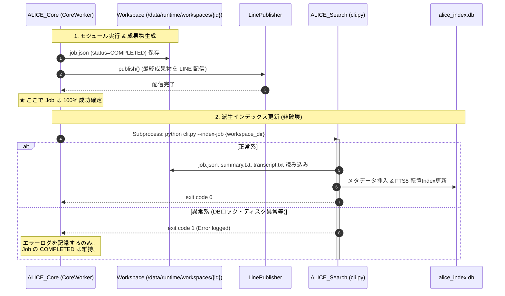
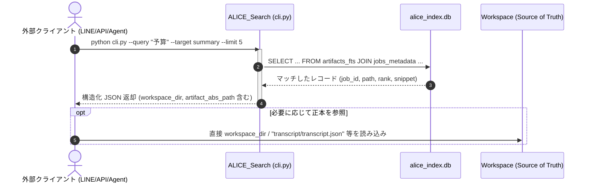

# ALICE v1.0 Knowledge & Search 全体設計書 (v1.1)

> Version: v1.1.0 (Design Phase - Post Review Revision)  
> Status: Approved Architecture Baseline  
> Author: Antigravity  
> Date: 2026-09-11  

---

## 1. 基本方針と設計原則

本設計は、ALICE が過去に処理した会話・要約・ジョブ情報を後から確実に検索・参照できるようにするための基盤設計です。

### 1.1 堅持する最上位原則
1. **1 Job = 1 Workspace**:
   * すべての入力・メタデータ・成果物・ログは `/data/runtime/workspaces/{job_id}/` に完結して保持される。
2. **Workspace = Source of Truth（源泉データ主義）**:
   * 検索用インデックス（SQLite + FTS5）は、**「失われても Workspace 群から 100% いつでも再構築できる派生キャッシュ（Read-Optimized Secondary Index）」** にすぎない。
3. **Core と Search の疎結合（Workspace Driven CLI）**:
   * `ALICE_Core` は検索ロジックを一切抱え込まず、独立モジュール `ALICE_Search` と CLI（Subprocess）を介して連携する。
4. **過剰最適化・将来機能先行実装の排除**:
   * Vector DB、Embedding、RAG、Knowledge Graph は v1.0 では一切実装しない。
   * 現行の `WorkspaceManager.list_jobs()` の $O(N)$ 線形走査も現時点で過剰に先行高速化せず、Search Index の完成後に自然に整理する。

---

## 2. ライフサイクルと耐障害性（Job成否とIndex更新の完全分離）

### 2.1 実行順序とエラー分離の原則
**「Search Index の更新失敗は、Job 本体の成功条件に絶対に含めない」**

従来の懸念であった「検索インデックスの書き込み失敗によって、正常に終了した Job が FAILED になる」事故を構造的に排除します。

```text
[ジョブ実行パイプラインの順序]
1. Module 実行 (Transcript → Summary)
2. 全ステップ成功判定
3. Job Status = COMPLETED (job.json アトミック保存)
4. Publisher による LINE 配信 (ユーザーへの成果物到達)
   ──────────────────────────────────────────────────
   [ここが成否境界: Job 自体はここで 100% 成功完了]
   ──────────────────────────────────────────────────
5. [非ブロッキング / 派生処理] ALICE_Search CLI による Index 更新
   ├─ 成功: Index が最新 Workspace と同期
   └─ 失敗: エラーログを記録するのみ。Job の COMPLETED は絶対に覆さない。
            (Index は後から --reindex で完全修復可能)
```

### 2.2 派生インデックス（Eventual Consistency）の保証
* Index は「最新でない可能性がある派生キャッシュ」として扱います。
* 万が一、システムの突発的ダウンやロック競合で Index 更新がスキップされた場合でも、Job の正本（Workspace）は完全な状態で保存されています。
* 管理コマンド `python cli.py --reindex` を定期バッチ（cron）や手動で実行することで、すべての Workspace から Index を最新状態へ安全にリカバリできます。

---

## 3. 検索データモデル（Query / Target / Result）

### 3.1 Search Query の 2 軸分離設計
「9月の会議（メタデータ）で、予算について話したもの（全文）」を柔軟に検索できるよう、検索クエリを概念的に **Full Text Query** と **Metadata Filters** に明確に分離します。

```text
┌─────────────────────────────────────────────────────────────┐
│                    Search Query Model                       │
├──────────────────────────────┬──────────────────────────────┤
│ 1. Full Text Query           │ 2. Metadata Filters          │
│ (キーワード・自由文検索)     │ (構造化属性による絞り込み)   │
├──────────────────────────────┼──────────────────────────────┤
│ ・query: str                 │ ・user_id: str | None        │
│   (例: "来期 予算")          │ ・date_from: datetime | None │
│                              │ ・date_to: datetime | None   │
│                              │ ・workflow: str | None       │
│                              │ ・status: str | None         │
│                              │ ・module: list[str] | None   │
│                              │   (例: ["summary", "trans"]) │
└──────────────────────────────┴──────────────────────────────┘
```

### 3.2 検索対象 Artifact の選定（`transcript.json` の扱い）
* **`transcript.json` の役割**:
  * 各発話の開始・終了タイムスタンプ、話者ラベルを含む **一次構造化データ（Source of Truth）** として維持する。
  * JSON 構造（キー名、タイムスタンプ文字列など）が全文検索のトークンに混入すると検索精度を著しく落とすため、**FTS の全文検索対象には直接含めない**。
* **全文検索対象は原則 `*.txt` / `*.md`**:
  * `summary.txt` / `summary.md` (要約プレーンテキスト/Markdown)
  * `minutes.txt` / `minutes.md` (将来の議事録テキスト/Markdown)
  * `transcript.txt` (一次発話プレーンテキスト)
* **検索結果からの `transcript.json` 参照性**:
  * 全文検索で `transcript.txt` の特定箇所がヒットした場合、検索結果に `workspace_dir` が含まれているため、呼び出し側は必要に応じて `workspace_dir / "transcript" / "transcript.json"` を開いて正確な発話タイムスタンプや話者情報を取得できる設計とします。

### 3.3 中立的な検索結果（Result）モデルと正本参照性
Summary を固定優先とするハードコードは行わず、スコアリングや重み付けは将来の評価フェーズに委ね、まずは各モジュールのヒット状況を中立・構造的に返却します。
また、**「検索結果から Workspace 上の正本 Artifact へ完全に辿れること」** を v1.0 の必須要件とします。

```python
@dataclass
class SearchHit:
    """検索ヒット項目"""
    job_id: str
    user_id: str
    module: str                  # "summary", "transcript", "minutes"
    artifact_name: str           # "summary.txt", "transcript.txt"
    artifact_rel_path: str       # "summary/summary.txt"
    artifact_abs_path: Path      # "/data/runtime/workspaces/{id}/summary/summary.txt"
    workspace_dir: Path          # "/data/runtime/workspaces/{id}"
    snippet: str                 # マッチ周辺のテキスト抜粋 (ハイライト付き)
    rank_score: float            # FTS5 BM25 スコア (中立的指標)
    created_at: datetime         # ジョブ作成日時
    metadata: dict               # 元ファイル名、ワークフロー等の付加情報
```

---

## 4. Index & Storage 設計 (SQLite + FTS5)

### 4.1 データベース物理配置
* ファイルパス: `/data/runtime/search/alice_index.db`
* 特性: 単一ファイル、外部デーモン不要、Python 組み込み `sqlite3` で直接操作可能。

### 4.2 スキーマ定義
メタデータの完全一致・範囲検索（B-Tree）と、テキスト本文の全文検索（FTS5）を分離したテーブル構成とします。

```sql
-- 1. Job メタデータテーブル (B-Tree Index)
CREATE TABLE IF NOT EXISTS jobs_metadata (
    job_id TEXT PRIMARY KEY,
    user_id TEXT NOT NULL,
    status TEXT NOT NULL,
    workflow TEXT NOT NULL,
    original_filename TEXT,
    workspace_path TEXT NOT NULL,
    created_at TIMESTAMP NOT NULL,
    completed_at TIMESTAMP,
    has_transcript INTEGER DEFAULT 0,
    has_summary INTEGER DEFAULT 0,
    has_minutes INTEGER DEFAULT 0
);
CREATE INDEX IF NOT EXISTS idx_jobs_user_created ON jobs_metadata(user_id, created_at DESC);
CREATE INDEX IF NOT EXISTS idx_jobs_created ON jobs_metadata(created_at DESC);
CREATE INDEX IF NOT EXISTS idx_jobs_status ON jobs_metadata(status);

-- 2. 成果物全文検索仮想テーブル (FTS5 転置インデックス)
CREATE VIRTUAL TABLE IF NOT EXISTS artifacts_fts USING fts5(
    job_id UNINDEXED,
    module,           -- 'summary', 'transcript', 'minutes'
    artifact_name,    -- 'summary.txt', 'transcript.txt'
    content,          -- 成果物のテキスト本文
    tokenize = 'trigram'
);
```

### 4.3 FTS5 Trigram の位置づけと実装時検証項目
「日本語が 100% 検索できる」といった過度の断定を排し、FTS5 trigram を第一候補として採用しつつ、実装時に以下の項目をテストコードによって厳格に検証します。

| 検証項目 | 懸念点 / テスト内容 | 検証方針 |
| :--- | :--- | :--- |
| **1. 2文字以下の検索** | trigram（3文字N-gram）では 1〜2 文字（例: "AI", "予算"）の検索で挙動が制限されるか | FTS5 trigram の prefix クエリ（`予*`, `予算*`）の挙動確認 |
| **2. 日本語の助詞・活用** | 「話し合った」「話します」「話した」など語尾変化の一致精度 | trigram による部分一致（`話`）の網羅性をテスト |
| **3. 英数字・記号** | "GPT-4", "v1.0", "Ollama" などの記号混じり単語の一致 | トークナイズ時の記号分離とフレーズ検索テスト |
| **4. 固有名詞・専門用語** | 人名（佐藤、田中）、社名、専門技術用語の検索漏れがないか | 多様な固有名詞を含む発話サンプルでのテスト |
| **5. 部分一致とノイズ** | 意図しない部分一致による偽陽性（ノイズ）の発生度合い | 検索結果の精度（Precision）の評価 |
| **6. ランキングスコア** | FTS5 組み込みの `bm25()` 関数の妥当性 | ヒット箇所とスコア順序の定性確認 |

---

## 5. Core / Search モジュール境界と CLI 仕様

### 5.1 モジュール境界と非依存の原則
* `ALICE_Core` は `ALICE_Search` の Python クラスを直接 `import` してはならない。
* `ALICE_Search` は `ALICE_Core` のコードを直接 `import` してはならない（Workspace 上のファイルのみを読み取る）。
* 連携はすべて **Workspace Driven CLI（Subprocess 呼び出し）** で完結する。

### 5.2 CLI インターフェース仕様 (`ALICE_Search/cli.py`)

#### (1) 単一 Workspace インデックス登録 / 更新
```bash
python /home/takuya/Project_ALICE/ALICE_Search/cli.py --index-job <workspace_dir>
```
* 動作: 指定された Workspace 内の `job.json`, `summary/summary.txt`, `transcript/transcript.txt` を読み込み、`alice_index.db` に UPSERT（更新または挿入）する。
* 戻り値: 成功時 `0`、失敗時 `1`（標準エラー出力にエラー理由）。

#### (2) 検索実行
```bash
python /home/takuya/Project_ALICE/ALICE_Search/cli.py \
    --query "来期予算" \
    --user "U794535d58fb802ac996f4a86ce119ad2" \
    --target "summary" \
    --limit 5
```
* 標準出力（JSON 形式）:
```json
{
  "total": 1,
  "query": "来期予算",
  "filters": {
    "user_id": "U794535d58fb802ac996f4a86ce119ad2",
    "target": "summary"
  },
  "hits": [
    {
      "job_id": "job_20260911_211704_test_line_summary",
      "user_id": "U794535d58fb802ac996f4a86ce119ad2",
      "module": "summary",
      "artifact_name": "summary.txt",
      "artifact_rel_path": "summary/summary.txt",
      "artifact_abs_path": "/data/runtime/workspaces/job_20260911_211704_test_line_summary/summary/summary.txt",
      "workspace_dir": "/data/runtime/workspaces/job_20260911_211704_test_line_summary",
      "snippet": "...来期の<b>予算</b>配分について、AIサーバーの拡充を優先することで合意...",
      "rank_score": -12.45,
      "created_at": "2026-09-11T21:17:04"
    }
  ]
}
```

#### (3) 全体再インデックス（Rebuild）
```bash
python /home/takuya/Project_ALICE/ALICE_Search/cli.py --reindex [--workspaces-dir /data/runtime/workspaces]
```
* 動作: `/data/runtime/workspaces/` 配下の全ディレクトリを走査し、DB を 0 から完全再構築する。

---

## 6. 将来の Semantic Search / RAG への拡張ロードマップ

v1.0 で構築する「検索結果 → Workspace / Artifact 参照」という基盤は、将来の Semantic Search / RAG にとっての不可欠なアンカー（足場）となります。

```text
[v1.0: 基礎インデックスと原本参照]
  Search Hit ──> job_id ──> Workspace ──> 正本 Artifact (summary.md, transcript.json)
       │
       ▼ [v1.x: セマンティック検索の追加]
  Chunking Engine
    ├─ transcript.json のトピック・発話ブロック分割 (100〜300トークン)
    └─ summary.md の見出しセクション分割
       │
       ▼
  Local Embedding (Ollama nomic-embed-text 等)
       │
       ▼
  Hybrid Retrieval (FTS5 BM25 + Vector Cosine 類似度の RRF 統合)
       │
       ▼ [v2.0: 知識統合と RAG]
  ALICE_Knowledge
    ├─ 上位チャンクの Reranking
    ├─ Context Assembly (Workspace から該当文脈を抽出)
    └─ LLM による自然言語回答生成
```

---

## 7. ALICE v1.0 の明確なスコープ定義（In Scope / Out of Scope）

本設計における v1.0 の到達点と、将来フェーズに残す境界を明確に固定します。

### 7.1 v1.0 で作ること (In Scope)
1. **独立モジュール `ALICE_Search` の構築**:
   - `ALICE_Search/cli.py` (`--index-job`, `--search`, `--reindex`)
2. **SQLite + FTS5 派生インデックス**:
   - `/data/runtime/search/alice_index.db`
   - B-Tree メタデータ管理 & FTS5 trigram 全文検索
3. **Query モデルの分離**:
   - Full Text Query と Metadata Filter（user_id, date, module 等）の分離
4. **正本 Artifact への完全な参照性**:
   - 検索結果に `workspace_dir`, `artifact_abs_path`, `job_id` を含める
5. **Source of Truth からの再構築機能**:
   - `--reindex` による全 Workspace からの 100% 再生成
6. **CoreWorker からの安全なインデックス呼び出し**:
   - Job 成功完了後に呼び出し、失敗しても Job の COMPLETED を脅かさない耐障害設計

### 7.2 v1.0 で作らないこと (Out of Scope / 将来フェーズ)
* **Embedding 生成 & ベクトル計算**
* **Vector DB の導入（Chroma, Qdrant 等）**
* **Semantic Search（コサイン類似度検索）**
* **Reranker（クロスエンコーダー再ランク）**
* **RAG（検索結果をもとにした LLM 回答生成）**
* **Knowledge Graph（エンティティ関係抽出）**
* **ALICE_Knowledge モジュール**
* **LINE 上の検索対話 UI 実装**（v1.0 では CLI / 基盤 API レベルに集中）
* **WorkspaceManager.list_jobs() の不要な先行高速化**

---

## 8. 推奨ディレクトリ構成

```text
Project_ALICE/
├── ALICE_Core/                 # オーケストレーター (検索ロジックは持たない)
│   ├── core/
│   │   └── worker.py           # Job 完了後に ALICE_Search CLI を呼出 (エラー分離)
│   └── ...
├── ALICE_Search/               # 【新規モジュール】
│   ├── cli.py                  # CLI エントリーポイント (--search, --index-job, --reindex)
│   ├── config.py               # DBパス設定 (/data/runtime/search/alice_index.db)
│   ├── core/
│   │   ├── indexer.py          # Workspace 読込 & FTS5/B-Tree インデックス作成
│   │   ├── searcher.py         # Metadata Filter + FTS5 クエリ実行
│   │   └── schema.py           # SQLite スキーマ定義
│   ├── models/
│   │   ├── query.py            # SearchQuery (text, filters) データクラス
│   │   └── result.py           # SearchHit, SearchResult データクラス
│   ├── README.md               # モジュール仕様書
│   └── tests/
│       ├── test_fts_trigram.py # 2文字検索、日本語、英数字、固有名詞の検証テスト
│       └── test_search_e2e.py  # インデックス、検索、再構築の総合テスト
├── ALICE_Summary/
├── ALICE_Transcript/
├── ALICE_Minutes/
├── ALICE_CoPilot/
└── /data/runtime/
    └── search/                 # 検索インデックス専用領域
        └── alice_index.db      # 派生キャッシュ DB (再構築可能)
```

---

## 9. 処理シーケンス図

### (1) ジョブ完了時のインデックス更新シーケンス（エラー分離）


### (2) 検索実行シーケンス（正本参照リンク）

